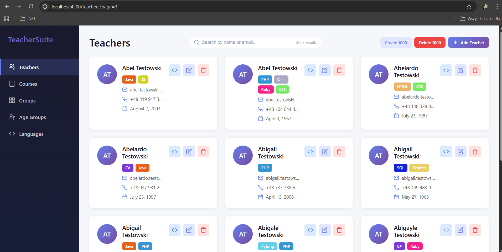
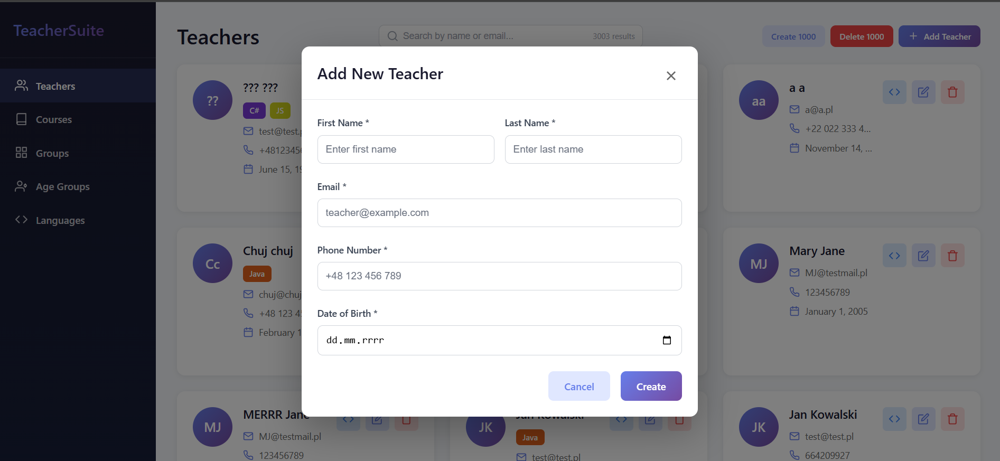
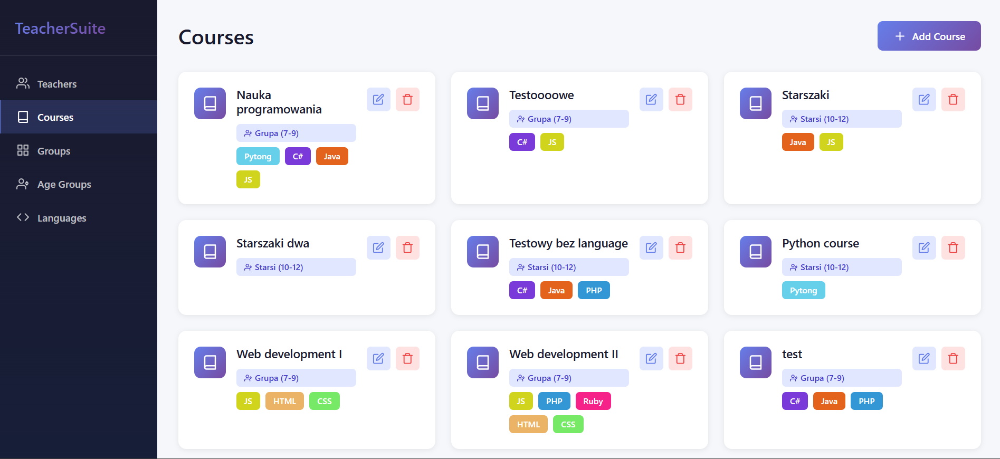
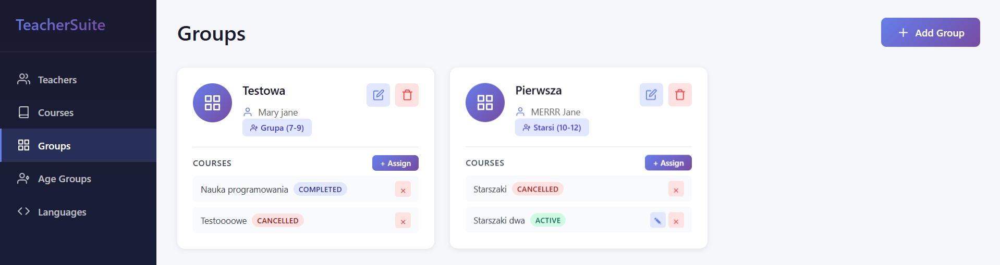

# TeacherSuite

TeacherSuite single page application will be a teacher's record book used in many different locations. For now TeacherSuite focuses on teaching programming courses. Teachers facilitating lessons will register absences, grades, prepare materials. There will be multiple locations with many groups, courses and teachers. TeacherSuite will allow for maintaining and proposing lesson materials.

       
### Setup
As of March 2026 - TeacherSuite is  available only on the development environment. It requires containarization software for running PostgreSQL and Keycloak.
### Technology stack
- Main stack: **Angular 21 + .NET 10**
- Code architecture: **Clean Architecture**
- Database: **PostgreSQL**
- Identity Provider: **Keycloak**
- Techniques: CQRS, Mediator pattern
- Libraries
    - MediatR
    - AutoMapper (to be removed)
    - Ardalis Guard Clauses
    - FluentValidation
    - Bogus
    - xUnit
    - RxJS

### User types
There will be 3 types of users:
- Admin - administering every functionality, accesses,
- Supervisor - administering locations, teachers, groups
- Teacher - registering lessons, maintaining materials
### Functionalities
-  [x] Teachers - maintaining teacher data, skills and groups assignments.
-  [x] Courses -  covers what to teach and for which age group.
-  [x] Groups - groups of students with a course and a teacher assigned to them.  
-  [x] Languages - for now TeacherSuite focuses on teaching programming languages
-  [ ] Age Groups
-  [ ] Students
-  [ ] Locations
-  [ ] Lessons
-  [ ] Lessons Plan
-  [ ] Grades
-  [ ] Materials
-  [ ] Substitutes

### Middleware
-  [x] Authentication
-  [x] Authorization
-  [x] Global Exception Handling
-  [x] Logging
-  [ ] Caching
-  [ ] RateLimiting

### Teachers

### Courses

### Groups
